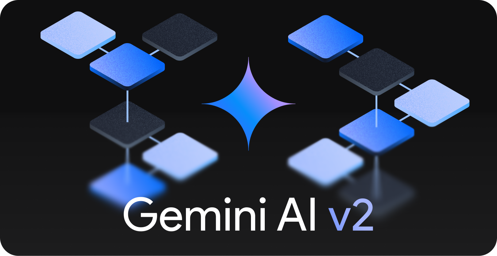

<p align="center">
  <a aria-label="NPM Version" href="https://www.npmjs.com/package/gemini-ai">
    
  </a>
  <a aria-label="NPM Download Count" href="https://www.npmjs.com/package/gemini-ai">
    
  </a>
  <a aria-label="Gemini AI Size" href="https://www.npmjs.com/package/gemini-ai">
    
  </a>
</p>
<p align="center">
  <a href="#documentation">Docs</a> | <a href="https://github.com/evanzhoudev/gemini-ai">GitHub</a> | <a href="#faq">FAQ</a>
</p>

## Features

- 🌎 [**Multimodal**](#auto-model-selection): Interact with images, videos, audio, and more, built into the model.
- 🌐 [**Contextual Conversations**](#geminicreatechat): Chat with Gemini, built in.
- 🧪 [**Simple Parameters**](#method-patterns): Easily modify `temperature`, `topP`, and more
- ⛓️ [**Streaming**](#streaming): Get AI output the second it's available.
- 🔒 [**Typesafe**](#types): Types built in. Gemini AI is written with TypeScript

## Why Gemini AI

> Why should I use this, instead of Google's [own API](https://www.npmjs.com/package/@google/generative-ai)?

It's all about simplicity. Gemini AI allows you to make requests to Gemini at just about a quarter of the code necessary with Google's API.

<details>
<summary>Don't believe me? Take a look.</summary>

<br>

Google's own API (CommonJS):

```javascript
const { GoogleGenerativeAI } = require("@google/generative-ai");

const genAI = new GoogleGenerativeAI(API_KEY);

async function run() {
	const model = genAI.getGenerativeModel({ model: "gemini-1.5-pro-latest" });

	const prompt = "Hi!";

	const result = await model.generateContent(prompt);
	const response = await result.response;
	const text = response.text();
	console.log(text);
}

run();
```

Gemini AI (ES6 Modules):

```javascript
import Gemini from "gemini-ai";

const gemini = new Gemini(API_KEY);
console.log(await gemini.ask("Hi!"));
```

That's nearly 4 times less code!

</details>

There's also more...

- ⚡ [**Native REST API**](#inititalization): Simplicity without compromise.
- 📝 [**Optimized File Uploads**](#optimized-file-uploads): Automatically uses Google's File API when necessary
- 📁 [**Automatic File Type Detection**](#optimized-file-uploads): Gemini AI will detect MIME types of files automatically
- 🧩 [**Automatic Request Creation**](#array-form): Auto-formats your requests—So you don't have to.

## Table of Contents

- [**Installation**](#installation)
- [**Getting an API Key**](#getting-an-api-key)
- [**Quickstart**](#quickstart)
- [**Special Features**](#special-features)
- [**Documentation**](#documentation)
  - [Initialization](#inititalization)
  - [Method Patterns](#method-patterns)
  - [`Gemini.ask()` Method](#geminiask)
  - [`Gemini.count()` Method](#geminicount)
  - [`Gemini.embed()` Method](#geminiembed)
  - [`Gemini.createChat()` Method](#geminicreatechat)
- [**FAQ**](#faq)
- [**Contributors**](#contributors)

## Installation

Install with the following command, or the command for your favorite package manager.

```bash
npm install gemini-ai
```

Gemini AI is a pure ES6 Module, which means you will have to use it with `import`. It is recommended that your project is also ES6, but [look in the FAQ]() for a CJS (`require()`) workaround.

## Getting an API Key

1. Go to [Google AI Studio's API keys tab](https://aistudio.google.com/app/apikey)
2. Follow the steps to get an API key
3. Copy this key, and use it below when `API_KEY` is mentioned.

> [!WARNING]
> Do not share this key with other people! It is recommended to store it in a `.env` file.

## Quickstart

Make a text request:

```javascript
import Gemini from "gemini-ai";

const gemini = new Gemini(API_KEY);

console.log(await gemini.ask("Hi!"));
```

Make a streaming text request:

```javascript
import Gemini from "gemini-ai";

const gemini = new Gemini(API_KEY);

gemini.ask("Hi!", {
	stream: console.log,
});
```

Chat with Gemini:

```javascript
import Gemini from "gemini-ai";

const gemini = new Gemini(API_KEY);
const chat = gemini.createChat();

console.log(await chat.ask("Hi!"));
console.log(await chat.ask("What's the last thing I said?"));
```

### Other useful features

<details>
<summary>Make a text request with images:</summary>
<br>

```javascript
import fs from "fs";
import Gemini from "gemini-ai";

const gemini = new Gemini(API_KEY);

console.log(
	await gemini.ask(["What do you see?", fs.readFileSync("./cat.png")])
);
```

</details>

<details>
<summary>Make a text request with custom parameters:</summary>
<br>

```javascript
import Gemini from "gemini-ai";

const gemini = new Gemini(API_KEY);

console.log(
	await gemini.ask("Hello!", {
		temperature: 0.5,
		topP: 1,
	})
);
```

</details>

<details>
<summary>Embed text:</summary>
<br>

```javascript
import fs from "fs";

const gemini = new Gemini(API_KEY);

console.log(await gemini.embed("Hi!"));
```

</details>

## Special Features

### Streaming

Here's a quick demo:

```javascript
import Gemini from "gemini-ai";

const gemini = new Gemini(API_KEY);

gemini.ask("Write an essay", {
	stream: (x) => process.stdout.write(x),
});
```

Let's walk through what this code is doing. Like always, we first initialize `Gemini`. Then, we call the `ask` function, and provide a `stream` config. This callback will be invoked whenever there is new content coming in from Gemini!

Note that this automatically cuts to the `streamContentGenerate` command... you don't have to worry about that!

> [!TIP]  
> Realize that you don't need to call `ask` async if you're handling stream management on your own. If you want to tap the final answer, it still is returned by the method, and you call it async as normal.

### Types

Gemini AI v2 is completely written in TypeScript, which means that all parameters, and more importantly configuration, have type hints.

Furthermore, return types are also conditional based on what `format` you place in the configuration to guarentee great DX.

### Optimized File Uploads

Google requires large files to be sent through their dedicated File API, instead of being included directly in the `POST` request.

With Gemini AI, your uploads are automatically optimized so that when it's necessary, your files are routed through the File API, but otherwise, it sends them inline, for peak performance.

Here's how Gemini AI decides which files to send through the File API:

1. All videos are automatically uploaded via Files API (because Gemini wouldn't accept them otherwise)
2. If all of your files combined are under 20MB (Google-set limit), all non-videos will be included as `inline_data`, which is the faster method
3. If all of your files combined are over 20MB, all files will be uploaded via File API

This ensures the fastest file upload experience, while ensuring all your files are safely included.

Gemini also automatically detects the MIME type of your file to pass to the server, so you don't need to worry about it.

### Proxy Support

Use a proxy when fetching from Gemini. To keep package size down and adhere to the [SRP](https://en.wikipedia.org/wiki/Single_responsibility_principle), the actual proxy handling is delegated to the [undici library](https://undici.nodejs.org/#/).

Here's how to add a proxy:

Install `undici`:

```bash
npm i undici
```

Initialize it with Gemini AI:

```javascript
import { ProxyAgent } from "undici";
import Gemini from "gemini-ai";

let gemini = new Gemini(API_KEY, {
	dispatcher: new ProxyAgent(PROXY_URL),
});
```

And use as normal!

## Documentation

### Inititalization

To start any project, include the following lines:

> [!NOTE]  
> Under the hood, we are just running the Gemini REST API, so there's no fancy authentication going on! Just pure, simple web requests.

```javascript
// Import Gemini AI
import Gemini from "gemini-ai";

// Initialize your key
const gemini = new Gemini(API_KEY);
```

Learn how to add a `fetch` polyfill for the browser [here](#how-to-polyfill-fetch).

### Method Patterns

All model calling methods have a main parameter first (typically the text as input), and a `config` second, as a JSON. A detailed list of all config can be found along with the method. An example call of a function may look like this:

```javascript
await gemini.ask("Hi!", {
	// Config
	temperature: 0.5,
	topP: 1,
});
```

> [!TIP]  
> All methods (_except_ `Gemini.createChat()`) are async! This means you should call them something like this: `await gemini.ask(...)`

#### JSON Output

You have the option to set format to `Gemini.JSON`

```javascript
await gemini.ask("Hi!", {
	format: Gemini.JSON,
});
```

This gives you the full response from Gemini's REST API.

Note that the output to `Gemini.JSON` varies depending on the model and command, and is not documented here in detail due to the fact that it is unnecessary to use in most scenarios. You can find more information about the REST API's raw output [here](https://ai.google.dev/tutorials/rest_quickstart).

If you are using typescript, you get type annotations for all the responses, so autocomplete away.

### `Gemini.ask()`

This method uses the `generateContent` command to get Gemini's response to your input.

#### Uploading Media

The first parameter of the `ask()` method can take in 3 different forms:

##### String Form:

This is simply a text query to Gemini.

_Example:_

```javascript
await gemini.ask("Hi!");
```

##### Array Form:

In this array, which represents ordered "parts", you can put strings, or Buffers (these are what you get directly from `fs.readFileSync()`!). These will be fed, in order to Gemini.

Gemini accepts most major file formats, so you shouldn't have to worry about what format you give it. However, check out a [comprehensive list here](https://ai.google.dev/gemini-api/docs/prompting_with_media?lang=javascript#supported_file_formats).

There's a whole ton of optimizations under the hood for file uploads too, but you don't have to worry about them! [Learn more here...](#optimized-file-uploads)

_Example:_

```javascript
import fs from "fs";

await gemini.ask([
	"Between these two cookies, which one appears to be home-made, and which one looks store-bought? Cookie 1:",
	fs.readFileSync("./cookie1.png"),
	"Cookie 2",
	fs.readFileSync("./cookie2.png"),
]);
```

> [!NOTE]
> that you can also place buffers in the `data` field in the config (this is the v1 method, but it still works). These buffers will be placed, in order, directly after the content in the main message.

##### Message Form:

This is the raw message format. It is not meant to be used directly, but can be useful when needing raw control over file uploads, and it is also used internally by the `Chat` class.

Please check `src/types.ts` for more information about what is accepted in the `Message` field.

#### Config Available:

> [!NOTE]
> These are Google REST API defaults.

| Field Name          | Description                                                                                                                                                                                                    | Default Value                                                                       |
| ------------------- | -------------------------------------------------------------------------------------------------------------------------------------------------------------------------------------------------------------- | ----------------------------------------------------------------------------------- |
| `format`            | Whether to return the detailed, raw JSON output. Typically not recommended, unless you are an expert. Can either be `Gemini.JSON` or `Gemini.TEXT`                                                             | `Gemini.TEXT`                                                                       |
| `topP`              | See [Google's parameter explanations](https://cloud.google.com/vertex-ai/docs/generative-ai/start/quickstarts/api-quickstart#parameter_definitions)                                                            | `0.94`                                                                              |
| `topK`              | See [Google's parameter explanations](https://cloud.google.com/vertex-ai/docs/generative-ai/start/quickstarts/api-quickstart#parameter_definitions). Note that this field is **not** available on v1.5 models. | `32`                                                                                |
| `temperature`       | See [Google's parameter explanations](https://cloud.google.com/vertex-ai/docs/generative-ai/start/quickstarts/api-quickstart#parameter_definitions)                                                            | `1`                                                                                 |
| `model`             | `gemini-1.5-flash-latest`                                                                                                                                                                                      |
| `maxOutputTokens`   | Max tokens to output                                                                                                                                                                                           | `2048`                                                                              |
| `messages`          | Array of `[userInput, modelOutput]` pairs to show how the bot is supposed to behave                                                                                                                            | `[]`                                                                                |
| `data`              | An array of `Buffer`s to input to the model. It is recommended that you [directly pass data through the message in v2](#uploading-media).                                                                      | `[]`                                                                                |
| `stream`            | A function that is called with every new chunk of JSON or Text (depending on the format) that the model receives. [Learn more](#feature-highlight-streaming)                                                   | `undefined`                                                                         |
| `safetySettings`    | An object that specifies the blocking threshold for each safety rating dimension. [Learn more](#how-to-set-safety-settings)                                                                                    | An object representing Google's defaults. [Learn more](#how-to-set-safety-settings) |
| `systemInstruction` | Instruct what the model should act like (i.e. a persona, output format, style/tone, goals/rules, and additional context)                                                                                       | `""`                                                                                |

Example Usage:

```javascript
import Gemini from "gemini-ai";

const gemini = new Gemini(API_KEY);

console.log(
	await gemini.ask("Hello!", {
		temperature: 0.5,
		topP: 1,
	})
);
```

#### How to set Safety Settings

Google categorizes the Gemini's response with 4 main categories of safety ratings. Here's an overview:

| Category Name     | Description                               | Gemini AI Field name |
| ----------------- | ----------------------------------------- | -------------------- |
| Harassment        | Negative/Harmful comments towards someone | `harassment`         |
| Hate Speech       | Rude/Disrespectful/Profane                | `hate`               |
| Sexually Explicit | General sexual/lewd content               | `sexual`             |
| Dangerous         | Encourages harmful acts                   | `dangerous`          |

[Learn more at Google's official docs here.](https://ai.google.dev/gemini-api/docs/safety-settings#safety-settings)

In order to set each category, provide an object like this into the `safetySettings` configuration option:

```javascript
await gemini.ask("Hello!", {
	safetySettings: {
		hate: Gemini.SafetyThreshold.BLOCK_SOME,
		sexual: Gemini.SafetyThreshold.BLOCK_SOME,
		harassment: Gemini.SafetyThreshold.BLOCK_SOME,
		dangerous: Gemini.SafetyThreshold.BLOCK_SOME,
	},
});
```

Note that the names of the categories have been shortened, which you can reference above in the table.

You can assign 4 different thresholds (which are an enum under `Gemini.SafetyThreshold`) of blocking content, listed here from the strictest to the least strict:

| Enum Name                           | Google Internal Name     | Simple Description (In Specified Safety Category) |
| ----------------------------------- | ------------------------ | ------------------------------------------------- |
| `Gemini.SafetyThreshold.BLOCK_MOST` | `BLOCK_LOW_AND_ABOVE`    | Blocks everything that is potentially unsafe      |
| `Gemini.SafetyThreshold.BLOCK_SOME` | `BLOCK_MEDIUM_AND_ABOVE` | Blocks moderately unsafe content (Default)        |
| `Gemini.SafetyThreshold.BLOCK_FEW`  | `BLOCK_ONLY_HIGH`        | Blocks only highly unsafe content                 |
| `Gemini.SafetyThreshold.BLOCK_NONE` | `BLOCK_NONE`             | Blocks nothing                                    |

By Google's default, all categories are set to `BLOCK_SOME`. Google [also states](https://ai.google.dev/gemini-api/docs/safety-settings) that "Adjusting to lower safety settings will trigger a more indepth review process of your application."

### `Gemini.count()`

This method uses the `countTokens` command to figure out the number of tokens _in your input_.

Config available:
| Field Name | Description | Default Value |
| ------------- | ----------------------------------------------------------------------------------------------------------------------------------------------------------------------------------- | -------------------------- |
| `model` | Which model to use. Can be any model Google has available, but reasonably must be `gemini-pro` | Automatic based on Context |

Example Usage:

```javascript
import Gemini from "gemini-ai";

const gemini = new Gemini(API_KEY);

console.log(await gemini.count("Hello!"));
```

### `Gemini.embed()`

This method uses the `embedContent` command (currently **only on `embedding-001`**) to generate an embedding matrix for your input.

Config available:
| Field Name | Description | Default Value |
| ------------- | ----------------------------------------------------------------------------------------------------------------------------------------------------------------------------------- | -------------------------- |
| `model` | Which model to use. Can be any model Google has available, but reasonably must be `embedding-001` | `embedding-001` |

Example Usage:

```javascript
import Gemini from "gemini-ai";

const gemini = new Gemini(API_KEY);

console.log(await gemini.embed("Hello!"));
```

### `Gemini.createChat()`

`Gemini.createChat()` is a unique method. For one, it isn't asynchronously called. Additionally, it returns a brand new `Chat` object. The `Chat` object only has one method, which is `Chat.ask()`, which has the _exact same syntax_ as the `Gemini.ask()` method, documented [above](#geminiask). The only small difference is that most parameters are passed into the `Chat` through `createChat()`, and cannot be overriden by the `ask()` method. The only parameters that can be overridden is `format`, `stream`, and `data`.

All important data in the `Chat` object is stored in the `Chat.messages` variable, and can be used to create a new `Chat` that "continues" the conversation, as will be demoed in the example usage section.

Config available for `createChat`:
| Field Name | Description | Default Value |
| ------------- | ----------------------------------------------------------------------------------------------------------------------------------------------------------------------------------- | -------------------------- |
| `topP` | See [Google's parameter explanations](https://cloud.google.com/vertex-ai/docs/generative-ai/start/quickstarts/api-quickstart#parameter_definitions) | `0.94` |
| `topK` | See [Google's parameter explanations](https://cloud.google.com/vertex-ai/docs/generative-ai/start/quickstarts/api-quickstart#parameter_definitions). Note that this field is **not** available on v1.5 models. | `10` |
| `temperature` | See [Google's parameter explanations](https://cloud.google.com/vertex-ai/docs/generative-ai/start/quickstarts/api-quickstart#parameter_definitions) | `1` |
| `model` | `gemini-1.5-flash-latest` |
| `maxOutputTokens` | Max tokens to output | `2048` |
| `messages` | Array of `[userInput, modelOutput]` pairs to show how the bot is supposed to behave (or to continue a conversation), or a array of type `Message[]`, so you can directly input a previous `chat.messages` | `[]` |

Example Usage:

```javascript
// Simple example:

import Gemini from "gemini-ai";

const gemini = new Gemini(API_KEY);

const chat = gemini.createChat();

console.log(await chat.ask("Hi!"));

// Now, you can start a conversation
console.log(await chat.ask("What's the last thing I said?"));
```

```javascript
// "Continuing" a conversation:

import Gemini from "gemini-ai";

const gemini = new Gemini(API_KEY);

const chat = gemini.createChat();

console.log(await chat.ask("Hi!"));

// Creating a new chat, with existing messages

const newChat = gemini.createChat({
	messages: chat.messages,
});

console.log(await newChat.ask("What's the last thing I said?"));
```

## FAQ

Common Questions:

- [What's the difference between the `data` config and directly passing buffers in the message?](#whats-the-difference-between-data-and-directly-passing-buffers-in-the-message)
- [What do I need to update for Gemini AI v2?](#what-do-i-need-to-change-for-v2)
- [What is the default model?/Why is it the default model?](#what-is-the-default-model)
- [How do I change the API version?](#how-do-i-change-the-api-version)
- [How do I polyfill fetch?](#how-do-i-polyfill-fetch)
- [How do I use Gemini AI in CJS?/Cannot `require()` ESM Module](#how-do-i-use-gemini-ai-in-a-cjs-environment)

### What's the difference between `data` and directly passing buffers in the message?

> Are they the same thing?

`data` was the old way to pass Media data. It is now not recommended, but kept for backwards compatability. The new method is to simply pass an array of strings/buffers into the first parameter of `ask()`. The major benefit is now you can include strings between buffers, which you couldn't do before. Here's a quick demo of how to migrate:

With `data`:

```javascript
import fs from "fs";

await gemini.ask(
	"Between these two cookies, which one appears to be home-made, and which one looks store-bought?",
	{
		data: [fs.readFileSync("./cookie1.png"), fs.readFileSync("./cookie2.png")],
	}
);
```

New Version:

```javascript
import fs from "fs";

await gemini.ask([
	"Between these two cookies, which one appears to be home-made, and which one looks store-bought?",
	fs.readFileSync("./cookie1.png"),
	fs.readFileSync("./cookie2.png"),
]);
```

Learn more in the [dedicated section](#uploading-media).

### What do I need to change for v2?

> Does everything still work?

Yes! Gemini AI v2 should completely be backward-compatible. Most changes are under-the-hood, so your DX should be much smoother, [especially for TS developers](#types)!

The only thing that you can consider changing is using the new array message format instead of the old buffer format. See the [dedicated question](#whats-the-difference-between-data-and-directly-passing-buffers-in-the-message) to learn more.

### What is the default model?

> And, by extension, why is it the default model?

By default, Gemini AI uses `gemini-1.5-flash-latest`, Google's leading efficiency-based model. The reason that this is the default model is because of two main reasons regarding DX:

1. 📈 **Higher Rate Limits**: Gemini 1.5 Pro is limited to 2 requests per minute, versus the 15 for Flash, so we choose the one with the higher rate limit, which is especially useful for development.
2. ⚡ **Faster Response Time**: Gemini 1.5 Pro is a significant amount slower, so we use the faster model by default.

But, of course, should you need to change the model, it's as easy as passing it into the configuration of your request. For example:

```javascript
import Gemini from "gemini-ai";

const gemini = new Gemini(API_KEY);

console.log(
	await gemini.ask("Hello!", {
		model: "gemini-1.5-pro-latest",
	})
);
```

### How do I change the API Version?

> What if I want to use a deprecated command?

When initializing `Gemini`, you can pass in an API version. This feature mainly exists to futureproof, as the current recommended API version (and the one used) is `v1beta`. Note that some modern models (including the default Gemini 1.5 Flash) may not work on other API versions.

Here's how you can change it to, say, v1:

```javascript
import Gemini from "gemini-ai";

const gemini = new Gemini(API_KEY, {
	apiVersion: "v1",
});
```

### How do I Polyfill Fetch?

> I'm in a browser environment! What do I do?

Everything is optimized so it works for both browsers and Node.js—Files are passed as Buffers, so you decide how to get them, and adding a fetch polyfill is as easy as:

```javascript
import Gemini from "gemini-ai";
import fetch from "node-fetch";

const gemini = new Gemini(API_KEY, {
	fetch: fetch,
});
```

Nearly all `fetch` polyfills should work as of Gemini AI v2.2, as streaming is now done mainly through `response.body.getReader().read()`, but with a `AsyncIterator` fallback, so nearly all environments should be covered.

### How do I use Gemini AI in a CJS environment?

> I got `Error [ERR_REQUIRE_ESM]: require() of ES Module`, what can I do?

Gemini AI is a ESM (`import`) only module. It is recommended that you use ESM in your projects too. However, if you must use CJS, you can use dynamic imports. Here's an example:

```javascript
import("gemini-ai").then((Gemini) => {
	let gemini = new Gemini(API_KEY);
});
```

<h2 align="center" id="contributors">Contributors</h2>
<p align="center">A special shoutout to developers of and contributors to the <a href="https://github.com/EvanZhouDev/bard-ai"><code>bard-ai</code></a> and <a href="https://github.com/EvanZhouDev/palm-api"><code>palm-api</code></a> libraries. Gemini AI's interface is heavily based on what we have developed on these two projects.</p>
